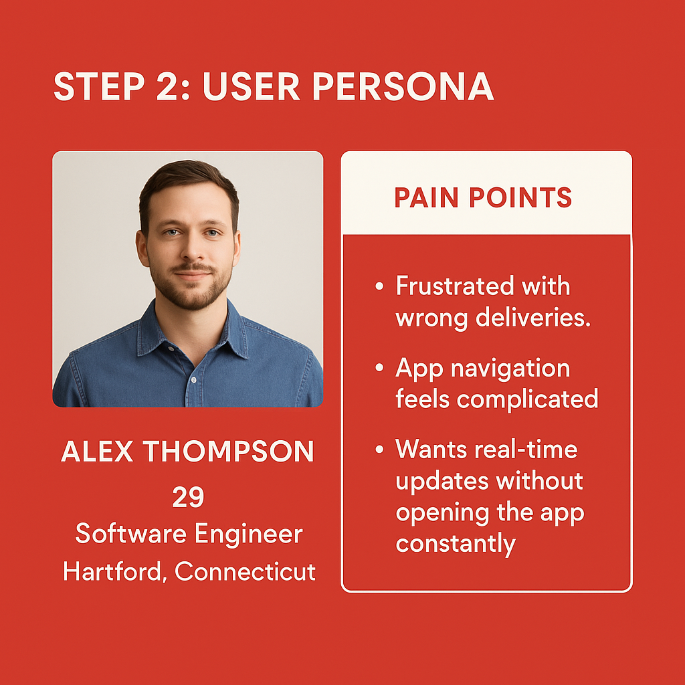
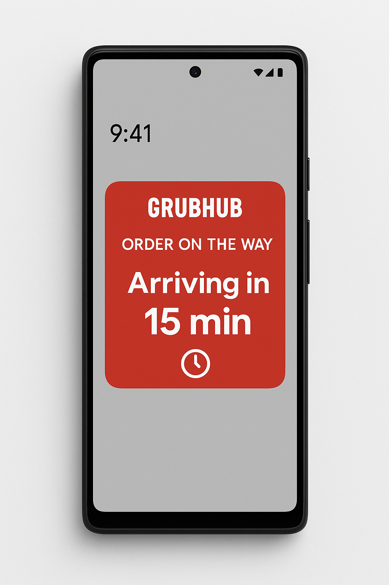
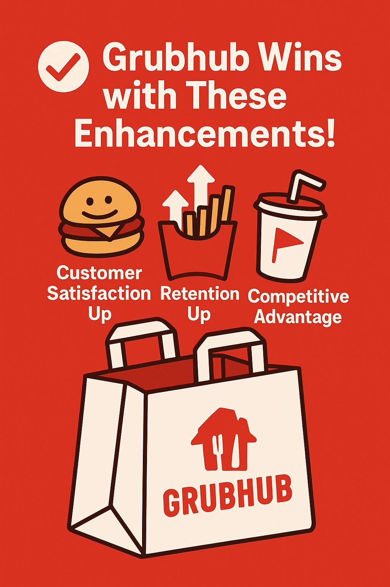

# Grubhub Platform Improvement — Product Case Study

A UX/Product improvement project focused on solving real user pain points on the Grubhub platform, with practical solutions, persona creation, solution mapping, and mobile UI mockups.

---

## Project Overview

Grubhub users face three main challenges:
-  Delivery errors (wrong delivery locations)
-  Cluttered and overwhelming app interface
-  Lack of real-time, convenient order tracking

This project proposes simple, high-impact solutions to fix these problems.

---

##  Case Study Steps

### Step 1: Problem Identification
Identified delivery location issues, cluttered UI, and tracking gaps.  

---

### Step 2: User Persona
Persona: Alex Thompson, a busy professional relying heavily on food delivery.  

---

### Step 3: Solution Mapping
Proposed Enhanced Delivery Verification, a Streamlined App Interface, and a Real-Time Order Tracking Widget.  

---

### Step 4: UI Mockups
Prototyped a mobile widget for tracking orders seamlessly.

- iPhone  
  

- Pixel  
  

---

### Step 5: Expected Outcomes
Expected improvements in customer satisfaction, retention, and competitive edge.  

---

## Impact Summary

- Increased customer satisfaction
- Faster reordering experience
- Competitive advantage over other delivery apps

---

## About Me

Hi! I'm Fazal, a Product Manager passionate about solving user problems with elegant solutions.  
Let's connect on [LinkedIn](https://www.linkedin.com/in/fazal-fazal-mba/)!

---

## Tools Used
- Figma (for mobile UI mockups)
- Canva (for graphic design and visual assets)
- GitHub (for project documentation and hosting)
- User Reviews Analysis (for identifying real-world pain points)
- Manual Research and Ideation (for solution mapping and persona building)

---

## License
This project is open-source under the MIT License.

